[TOC]


# 1.界面篇

## 1.1层级管理器

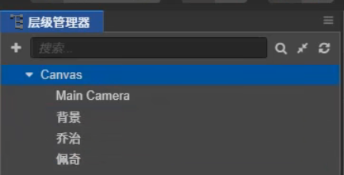

Canvas:画布  Main Camera:摄像机 

绘制时是依次绘制 所以按照绘制顺序是先绘制背景再依次绘制乔治与佩奇 若佩奇在背景之上 则会被背景遮蔽


# 2.节点篇

## 2.1节点的四个基础操作

**position:移动**     **rotation:旋转**    **scale: 缩放**  **size:矩形变换**  以下四个按钮依次对应这四个功能 快捷键依次为 **w e r t**

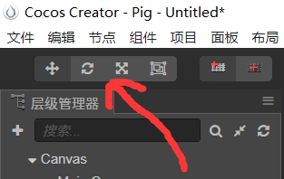

或者在**属性检查器**中的Node属性中设置相应属性 如图

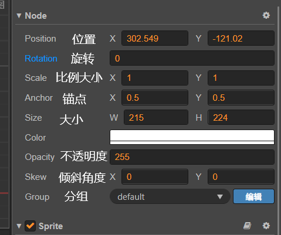

> 注意 :

 **1:** rotation属性中 **逆时针方向为 正值**

**2:** 父节点的缩放比例Rotation 会影响 子节点的缩放比例,而其他的操作自会改变子节点的位置(因为要保持相对位置)

## 2.2锚点Anchor 与位置

定义一个代表节点位置的一个点(坐标)

## 2.3Position

position是**相对坐标**,**相对于父节点**

如 父节点的(锚点)坐标 parent: position=(400,300)； 子节点的坐标 son: position=(0,0). 则son的实际节点为(400,300)

## 2.4 Sprite(精灵)

精灵（sprite）: 也就是精灵对象，就是游戏中的一个具有行为的元素。以超级玛丽为例，玛丽，敌人都算是一个精灵对象。

**精灵对象如下几个特点：**

1. 添加动画：作为精灵对象，就是动画的使用者。例如我们控制玛丽向不同方向的行走，玛丽会产生行走的动画。
2. 包含图像：对于另外一些精灵对象，它可能不需要运动动画，这时我们就可以只让它使用图像。
3. 能进行不同类型的运动：可以让精灵对象向不同方向，以不同加速度进行移动。

如图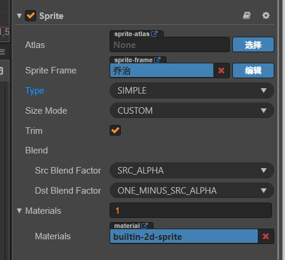

## 2.5 Label(文本节点:用来显示文本)

文本节点其实就是一个具有文本显示功能的节点 即文本节点=Node+Label

## 2.6UI节点

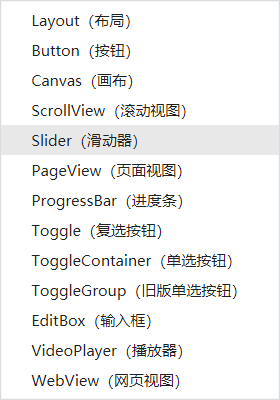

## 2.7 节点与组件(component)

### 2.7.1 基本解析:

组件(Component):表示一个功能

如:Sprite组件，用于显示一个图片

1. 节点本身是没有任何类型的，节点就只是一个节点而已，节点的功能是由它下面加挂的组件决定的
2. 一个节点可以挂载多个组件，但是渲染类只能挂一个 如不能同时挂Sprite和Labe

### 2.7.2 API获取节点与组件

#### 2.7.2.1 cc.find查找获取节点

当前节点 this.node:cc.Node

父节点:this.node.parent

子节点:this.node.children：cc.Node[]

**全局查找 cc.find()**   如:arget=cc.find("Canvas/佩奇/名字")

子节点查找 如 :target=cc.find("xx/yy",this.Node) 和this.node.getChildByName("Cannon 01");

#### 2.7.2.2 获取组件

获取组件：let label=node.getComponent(cc.Label)

获取自定义组件(脚本组件): let script=node.getComponent("Script")

## 2.8 父子节点

父子节点的关系:随之移动、旋转、缩放、且子节点的位置是相对于父节点的

## 2.9 节点的激活与禁用

```typescript
this.node.active=false //禁用该节点
this.node.active=true//激活该节点
```

**注意**：禁用一个节点会禁用这个节点和它的所有子节点,但子节点的active属性本身并没有改变


## 2.10 节点的销毁与判断

```js
this.node.destroy();//销毁节点

cc.isValid(node)// 如node节点已经销毁则返回false，未销毁则返回true
```


## 2.11 node属性概要

```typescript
// 从全局获取节点：全局获取的节点直接就是实例，不需要getChildByName
// 尽量通过属性装饰器@property获取节点，代码运行效率会更快。
// cc.find不安全，移动或变更节点名字时，忘记改代码会报错，代码可能要改很多。麻烦。
this.node = cc.find("Canvas/Menu");
 
this.node.children;//节点的子节点，是个数组
this.node.childrenCount;//子节点数量
this.node.active = false;//隐藏节点
this.node.name = "NewNode";//设置节点的名字
this.node.tag = 1001;//设置节点的标签
this.node.x = 100;//设置节点x轴坐标// 3.x版本弃用 请用 setPosition
this.node.y = 100;//设置节点y轴坐标// 3.x版本弃用 请用 setPosition
this.node.position = cc.v2(0, 0);//设置节点坐标// 未指定新指针 风险大
this.node.setPosition(0,0);
this.node.scaleX = 2;//设置节点x轴缩放比例// 3.x版本弃用
this.node.scaleY = 2;//设置节点y轴缩放比例// 3.x版本弃用
this.node.scale = 2;//设置节点缩放比例// 3.x版本弃用 请用setScale
this.node.rotation = 45;//设置节点的旋转角度//新版弃用，请使用angle 且angle正值为逆时针方向
this.node.width = 200;//设置节点宽度
this.node.height = 50;//设置节点高度
this.node.setContentSize(100, 100);//设置节点宽和高
this.node.color = new cc.color(100,100,100,255);//设置节点颜色（R,G,B,透明度）
this.node.color = cc.color('#787878');// ts版本颜色代码需要写成 cc.color('#787878'as any)
this.node.opacity = 128;//设置节点透明度（0~255）
this.node.anchorX = 1;//设置节点x轴锚点位置
this.node.anchorY = 0;//设置节点y轴锚点位置
this.node.setAnchorPoint(1, 0);//更改节点锚点位置
this.node.font;//字体文件
this.node.zIndex = 0;//设置此节点的Z轴深度，就是层级关系。默认0
```


# 3.脚本篇

## 3.1 脚步基本解析

### 3.1.1 生命期回调

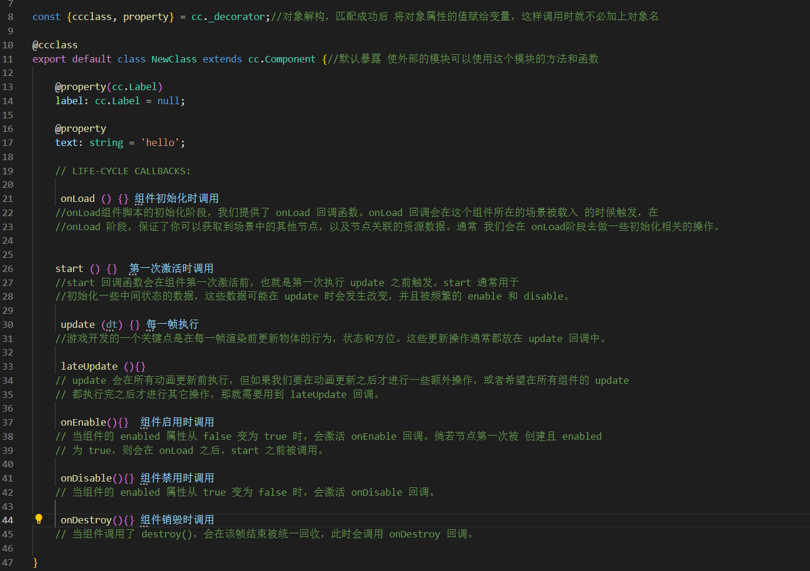

@property为装饰器(属性参数详见cocos手册)

若无@property注解,则不会出现在属性面板


## 3.2 全局对象——cc

## 3.3 脚本运行的原理

1. 游戏引擎加载所有的节点
2. 加载节点所有的组件

```typescript
var comp=new Pig();
node["Pig"]=comp;
comp.onLoad();
comp.start();   
```

**原理:**内部创建一个Pig组件对象(是我们创建的pig脚本),再将这个组件对象挂载到这个节点下面且名字就叫Pig,在依次调用这个组件的onLoad()与start()方法

## 3.4 事件响应事件

### 3.4.1基本语法:

```typescript
//与节点树相关的事件
this.node.on('foobar(事件)',callback(回调函数),target(目标),[false|true])

//与节点树不相关的各种全局事件(如键盘事件与设备中立事件)
cc.systemEvent.on(type, callback, target)
//可选type类型：
//cc.SystemEvent.EventType.KEY_DOWN (键盘按下)
//cc.SystemEvent.EventType.KEY_UP (键盘释放)
//cc.SystemEvent.EventType.DEVICEMOTION (设备重力传感)
const input={}
callback(e:KeyboardEvent){//以键盘事件为例
    console.log(e.keycode)//获取了按下的按钮码
    input[e.keycode]=1
}

updata(){
    if(input[e.macro.KEY.a]){//读取对应的按钮码
 ....      
    }
}
```

this:当前组件

this.node:当前组件

callback：需注意 这里只传入方法名 **不加括号**

target:调用这个回调方法的对象

这个事件默认是在冒泡阶段 如果希望注册在捕获阶段 可以使用第四个参数 true

### 3.4.2 常见事件

| (鼠标)点击事件 | 事件类型：MOUSE              | mousedown(鼠标按下）                                 | mouseup(鼠标抬起)                  | mousemove(鼠标移动)                   |                                           |
| -------------- | :--------------------------- | ---------------------------------------------------- | ---------------------------------- | ------------------------------------- | ----------------------------------------- |
| 键盘事件       | 事件类型：KeyboardEvent      | kyeup                                                | keydown                            |                                       |                                           |
| 触摸事件       | 事件类型：Touch              | touchstart(当手指触摸屏幕时触发)                     | touchend(当手指从屏幕上移开时触发) | touchcancel(当系统停止跟踪触摸时触发) | touchmove(当手指在屏幕上滑动时连续地触发) |
| 3d触摸事件     | 事件类型:cc.Event.EventTouch | **Node.EventType.TOUCH_START**(当手指触摸屏幕时触发) |                                    |                                       |                                           |

具体API详见<a href=https://docs.cocos.com/creator/manual/zh/engine/event/event-api.html>鼠标与触摸事件API</a> 如：

```typescript
getDelta：获取触点距离上一次事件移动的距离对象，对象包含 x 和 y 属性
getLocation：获取触点位置对象，对象包含 x 和 y 属性
...等等
```

**注意**:1.触摸事件坐标(x,y)为世界坐标

​         2.输入事件监听 input.on(是一个全局事件)

​        3. 节点事件监听 node.on 

### 3.4.3 阻止事件传递

```typescript
this.node.on('foobar', (event: MyEvent) => {
  event.propagationStopped = true;//该方法可以阻止事件传递
});
```

### 3.5.4 事件冒泡

e.stopPropagation()阻止事件传递


## 3.5 属性

属性一般分为两种类型:

1.基本类型: string  number boolean bigint

2.引用类型:

- cc.Node 节点 
- cc.SpriteFrame 图片帧资源
- cc.AudioClip 音频资源

# 3.音频

术语:

-  音乐 Music(BGM)
-  音效 Audio
-  配音 Voice

## 3.1 AudioSource组件

基本设置:Clip:音频素材  Volume:音量[0~1]  Loop:是否循环播放

​          Play on load: 是否激活时自动播放  Preload:是否预加载(先加载完整再播放)

常用方法

```typescript
@property(AudioSource)
audio:AudioSource=null;
audio.play();//播放音效
audio.mute=true/false//是否静音
audio.xxxx//更多功能可见API手册
```


## 3.2 AudioEngine API播放

```typescript
cc.audioEngine.paly(clip,loop,volume)//常见的用法
//实例 在前一个音效播放完毕后 再播放音效(防止出现音效混淆)
@property(cc.AudioClip)
audio:cc.AudioClip=null;
audioId:number=null;
onLoad(){
    this.node.on('touchstrat',this.onClick,this)
}
onClick(){
   if( this.audioId!=null) return;
    this.audioId=cc.audioEngine.play(this.audio,false,1)
    let that=this;
    cc.audioEngine.setFinishCallback(this.audioId,function(){
        that.audioId=null;
    })
}
```

详见<a href="https://docs.cocos.com/creator/2.4/api/zh/classes/audioEngine.html#play">audioEngine</a>手册(ctrl+左击进入网页)

# 4.坐标系

## 4.1坐标基本概念

坐标使用Vec2或者Vec3表示(Vector,向量)

1. 创建Vec2：二维坐标(x,y)有两种方法

      1.pos=new cc.Vec2(100,100)即直接使用new 来创建一个Vec2对象

      2.pos=cc.v2(100,100) 使用cc给出的方法来定义(使用较多)

2. 创建Vec2：二维坐标(x,y,z)同上有两种方法

## 4.2 节点坐标的获取与修改

| 获取坐标       | let pos：cc.Vec2=node.getPosition()                          |
| -------------- | ------------------------------------------------------------ |
| 设置坐标1      | node.setPosition(cc.v2(200,100))或 node.setPosition(cc.v3(200,100,0)); |
| 设置坐标2      | node.x与node.y也能直接读取和修改节点的坐标                   |
| 设置节点的缩放 | node.setScale(cc.v3(1,1,0)) 2d游戏z轴只需要设置为0即可       |

## 4.3本地坐标与世界坐标的转换

```typescript
参照物.convertToNodeSpace、convertToWorldSpace:都是以参照物的坐下角作为坐标点原点，向右和向上创建坐标系。

参照物.convertToNodeSpace(需要转换的坐标,下同):获得的坐标相对于参照物的坐标。

参照物.convertToWorldSpace:获得的坐标是参照物所在的坐标系中的坐标，即转换到参照物的世界坐标。

参照物.convertToNodeSpaceAR、convertToWorldSpaceAR:是以参照物的锚点为原点，向右、向上创建坐标系。

参照物.convertToNodeSpaceAR:获得的坐标相对于参照物的坐标（此时坐标系的原点在参照物的锚点）。

参照物.convertToWorldSpaceAR:获得的坐标是参照物所在的坐标系中的坐标，即转换到参照物的世界坐标（此时坐标系的原点在参照物的锚点）。

这样理解比较简单写，有AR的是以参照做的锚点作为新建坐标系的原点，没有AR的是以参照物的左下角作为新建坐标系的原点。
```


## 4.4 角度

1.==归一化== 坐标.noemalize 设坐标为(3,4) 向量长度为5 归一化后 使向量长度为1 相对的坐标就变成了(3/5,4/5)相当于获得了 坐标的cos值 与sin值

2.==弧度计算==：坐标.signAngle(cc.Vec(x,y))得到两个向量之间的弧度   换算公式  角度(angle)=(radian)弧度 / PI * 180 

3.==改变朝向==：可通过缩放(scale)属性来修改——即修改对应方向上的scaleX或scaleY来达到换向目的

```typescript
let scaleX=Math.abs(this.node.scaleX);
this.node.scaleX=-scaleX  //取反方向
this.node.scaleX=scale //换回
```

## 4.5 获取方位

```typescript
let pos:cc.vec3 =a.position.sub(b.position) 
//相对于 a.position-b.position
//可以用于获取a相对于b的方向
```


# 5.缓动系统cc.tween()

## 5.1参考代码

```js
cc.tween(node)
.to(1,(position:cc.v3(100,200,0)))//这里的1 为缓动所需时长
.call(function(){})//使用.call来调用匿名函数
.start();
//以上为链式调用
//相当于：
// 创建一个 cc.Tween 类型的对象
let tween = cc.tween( node );  

// tween.to()的返回值就是tween对象自身 
tween = tween. to(1, { position : cc.v3(100, 200, 0),rotation:30 } ) //并发动作位移旋转同时进行
             .to(1,{rotation:30},{easing:'quadOut'}); //连续动作 结束以上动作后 旋转

// 开始动作
tween.start();
```

## 5.2 接口简介

1. cc.tween().to:  对属性进行 **绝对值** 计算，最终的运行结果是设置的属性值，即修改为某个值。
2. cc.tween().by:对属性进行 **相对值** 计算，最终的运行结果是设置的属性值加上开始运行时节点的属性值，即变化值。

```
to(duration,args,easing) 
duration表示缓动时长
args表示动作结束时的参数，这个参数是一个对象，对象的属性可以有坐标position,旋转rotation等等
easing 表示变速运动，这个参数一个对象，对象的属性有逐步变慢'quadOut',逐步变快'quadIn'等等
```

```js
     onLoad () {//将baseketball脚本挂载到节点篮球上
        this.node.on('mousedown',this.mouse,this)}
    start () { }
    mouse(){
        let h=200;
       cc.tween(this.node)
       .by(1,{position:cc.v3(0,-h,0)},{easing:'quarIn'})
       .by(0.6,{position:cc.v3(0,h/3,0)},{easing:'quarOut'})
       .by(0.3,{position:cc.v3(0,-h/3,0)},{easing:'quarIn'})
       .start();
    }
```

   详见<a href="https://docs.cocos.com/creator/manual/zh/tween/?h=tween">Tween接口介绍</a>

# 6.动画系统updata(dt)

## 6.1 概念

updata()会被引擎每秒调用60次 即帧率为FPS=60

```
updata(dt){//作用节点每帧向前位移5像素的位置
if(this.node.x>=200)return;
this.node.x+=5;  
}
```

dt(delta time) 指上一帧的时间间隔，一般为0.016秒，或长或短

## 6.2 帧率FPS

一般来说帧率越高,操作系统的负载越大,所以可以适当调低帧率

使用 cc.game.setFrameRate(30);

**注意**：1.帧率是一个全局设置，所以一般在游戏的初始化脚本中设置

​           2.即建一个GameInitScript,挂在Canvas节点下(因为根节点Canvas先于子节点加载)

# 7. 常用API

## 7.1 计时器API

cocos提供了计时器API并封装在cc.Component中

```typescript
//启动定时器
comp.schedule(callback,interval,[repaet],[delay])
setTimeout(callback,数秒后执行)

//停止定时器
comp.unschedule(callback)
```

callback:计时器回调

interval:每次的时间间隔

repaet:重复次数 (若参数写为cc.macro.REPEAT_FOREVER则重复无限次)

delay:多少秒后启动(延时)

代码实例：使文本逐字出现

```typescript
    str:string=null;
    label:cc.Label=null;;
    index:number=0;    
   
    onLoad () {
        this.label=this.node.getComponent(cc.Label);
        this.str=this.label.string;//将文本内容赋给中间值
        this.label.string='';//清空文本
        this.schedule(this.ontime,0.3);//调用计时器
    }

    ontime(){
     this.index++;
     let text:string=this.str.substring(0,this.index);//字符串方法
     this.label.string=text;//将文本赋给组件文本框
     if(this.index>this.str.length){
         this.unschedule(this.ontime);//停止计时器
     }
     
    }
```

# 8.GIF的显示

## 8.1GIF素材准备

1. 从GIF中提取的每一张PNG图片应该**背景透明**
2. 提取的所有图片都需要添加到项目
3. 引擎会默认裁剪空白部分，可以逐个设置属性检查器，把trim Type设置为None

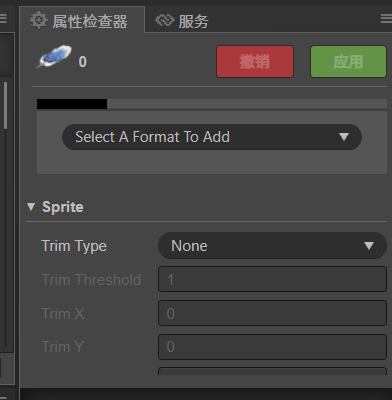

## 8.2 GIF显示

```typescript
   @property([cc.SpriteFrame])
   frame:cc.SpriteFrame[]=new Array();

   index:number=0;
   sprite:cc.Sprite=null;

    
    onLoad () {
        this.sprite=this.getComponent(cc.Sprite);
    }

    start () {
         this.schedule(this.ontime,0.1);
    }

   ontime(){
       if(this.frame.length==0){return;}
       this.sprite.spriteFrame=this.frame[this.index];
       this.index++;
       if(this.index>=this.frame.length){
           this.index=0;
       }

   }

   onDestroy(): void {
       this.unschedule(this.ontime);
   }
```

**注意**：

把一个属性定义为数组的方式:

注解： @property([cc.SpriteFrame])  其中[  ]表示这个属性是一个数组 cc.SpriteFrame表示这个数组中的元素类型 以此类推

对象： frame:cc.SpriteFrame[]=new Array();

# 9.动态加载

<span style="color:red">资源的加载是异步的</span>.

```typescript
 onClicked(){//指定单个资源
        let self = this;   
        cc.resources.load(path, type, callback (err, assets) {
            self.node.getComponent(cc.Sprite).spriteFrame = <cc.SpriteFrame> assets;
        });
}

//指定多个资源路径
cc.resources.load(paths,callback(err,assets:[元素类型]){})
paths类型为[cc.String],assets类型为[cc.Asset]
//指定一个资源目录
cc.resources.load(path,callback(err,assets:[元素类型]){})
psth为文件夹路径,assets类型为[cc.Asset]

//重要
cc.loader.loadRes(paths,type,callback(err,texture){
    })//可以规避使用泛型来指定类型

cc.loader.loadRes(roleMap[textData.role].url,cc.SpriteFrame,(err,texture)=>{
        this.picSprice.spriteFrame=texture;
    })
```

解析：

1. assets是cc.Asset的类型  可以使用<>来为泛型指定类型 如<cc.SpriteFrame> assets;
2. ==待加载的资源必须放在resources目录下==。
3. 路径不能加后缀名

# 10. 动画编辑器

## 10.1 创建动画步骤：

1. 添加节点

2. 在层级管理器里，添加一个 Sprite (单色) 节点。命名为‘方块’

3. 添加 Animation 组件

4. 选中‘方块’节点

5. 在属性检查器里，添加组件 | 其他组件 | Animation

6. 添加 Animation Clip 动画片段

7. 在资源管理器里，添加 anim 目录，添加 Animation Clip 。命名为‘移动方块’

   

8. 把 Clip 添加到 Animation 组件

9. 对照下图设置：

10. 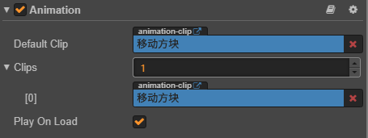

11. Animation 组件：用于播放 Animation Clip，就好比，Audio Source组件可以用于播放 Audio Clip一样

## 10.2 编辑动画

1. 选中节点:在层次管理器中，选中 ‘方块’ 节点(**不可以直接点击clip去编辑 必须去找挂载它的节点**)
2. 打开 动画编辑器 :若找不到这个面板，可以从菜单里重置一下 ( 恢复默认布局 )
3. 开始编辑:在动画编辑器里，点左上角按钮、开始编辑。
4. 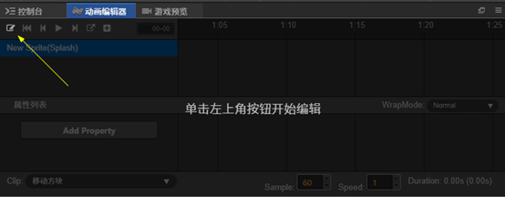 
5. 选择 Clip :在动画编辑器里，左下角Clip下拉列表。 一个Animation组件可以播放多个Clip，均显示在这里。
6. 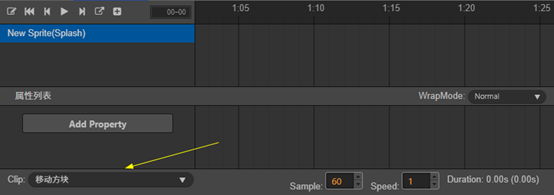
7. 选中你要编辑的 Clip ，开始编辑。
8. 保存与结束编辑:此时，场景编辑器中显示的不是场景，而是切换为 动画编辑状态。
9. 点保存时，所有动画数据保存到 Clip资源文件中。点关闭时，结束动画编辑状态，回到的场景编辑状态。

## 10.3 关键帧(Key Frame)

### 10.3.1 理解关键帧

1. 如一个节点 第0帧时位于(0,0),第10帧时位于(200,0),而**这个第0帧和第10帧就是关键帧**，因为只需要告诉animation组件这个动画的起始-结束位置即可,至于这个节点第5帧时在哪里并不重要 animation组件会根据需求自动求出
2. Animation Clip 是一个用来保存关键帧的数据的json格式文件，而Animation组件则会更具这个文件数据来实现动画效果

### 10.3.2 添加关键帧

1.选中‘方块’节点，编辑Animation组件下的 Clip

2.帧率

把 Sample 设为10，表示10帧每秒,可以认为Animation内部有一个定时器，这里就是设置定时器的频率。

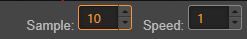

3.时间线

- 右键移动视图。
- 滚轮缩放视图。
- 时间线可以左右拖动。
- 在时间轴单击，可以直接定位时间线。
- 时间线移动时，左上会显示当前是第几帧。

如下所示：表示第1秒零4帧

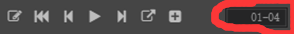

4、选择属性

左上窗格里，选中‘方块节点’

左下窗格里，点 Add Property | position 。添加完后显示如下：

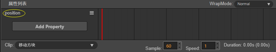

5、插入一个关键帧

将时间线拖到 00-00帧位置

点菜单，插入关键帧

### 10.3.3  关键帧注意事项

**注意：**1.关键帧可以插入，删除，和移动(可以拖动到一个新的时间点)

​           2.同一时间线可以有多个关键帧来修改多个属性 如：

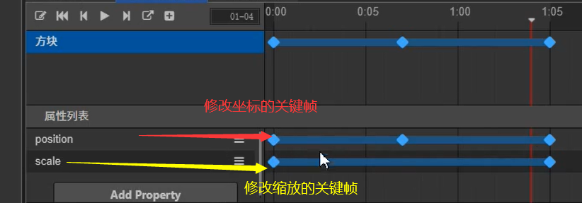

​          3.可通过修改WrapMode的值来达到各种效果 如Normal:播放一次。  loop: 循环播放 。PingPong:反复播放 。Reverse:倒放。等等

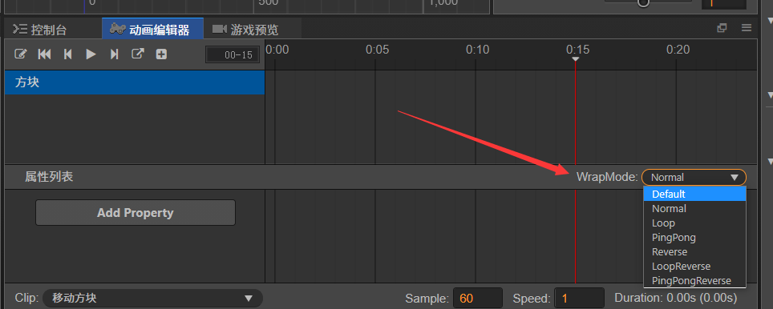


### 10.3.4 帧动画的使用


1. 首先准备好如上图所示每一帧图片
2. 因为要变化的是每一帧的图片 所以属性选择 cc.sprite.spriteFrame
3. 可选择将每一帧图片逐个拖动至相应关键帧上，也可选择全选图片帧一起拖动至时间线上自动创建关键帧

**注意：**

因为图片帧之间是直接进行替换，而**无法进行差值运算，也就没有所谓的过渡状态**，所以如上图所示 帧动画之间是没有蓝色连线的

cocos支持帧动画，**骨骼动画**

### 10.3.5 不规则路径

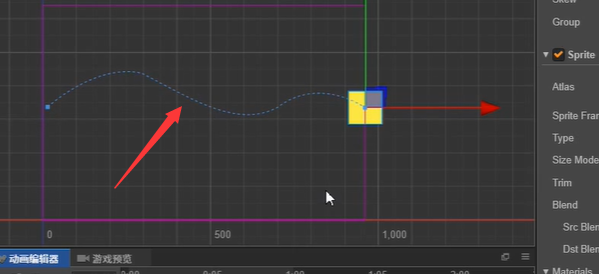

在利用关键帧定义好节点的移动路线时 会产生如上的路径虚线，将鼠标移动至虚线上并点击 则可以只有编辑移动路径

## 10.4 动画播放等函数

```typescript
var anim = this.node.getComponent(cc.Animation);
// 如果没有指定播放哪个动画，并且有设置 defaultClip 的话，则会播放 defaultClip 动画
anim.play();

// 指定播放 test 动画
anim.play('test');

// 指定从 1s 开始播放 test 动画
anim.play('test', 1);

// 使用 play 接口播放一个动画时，如果还有其他的动画正在播放，则会先停止其他动画
anim.play('test2');

var anim = this.getComponent(cc.Animation);

anim.play('test');

// 指定暂停 test 动画
anim.pause('test');

// 暂停所有动画
anim.pause();

// 指定恢复 test 动画
anim.resume('test');

// 恢复所有动画
anim.resume();

// 指定停止 test 动画
anim.stop('test');

// 停止所有动画
anim.stop();
```

详见[官方文档-ctrl加单机打开](https://docs.cocos.com/creator/2.4/manual/zh/animation/scripting-animation.html#animationstate).

## 10.5 动画回调与AnimationState

如果说 **AnimationClip** 是作为动画数据的承载，那么 **AnimationState** 则是 **AnimationClip** 在运行时的实例

```typescript
var animation = this.node.getComponent(cc.Animation);

// 注册
animation.on('play',      this.onPlay,        this);//开始播放时
animation.on('stop',      this.onStop,        this);//停止播放
animation.on('lastframe', this.onLastFrame,   this);//暂停播放
animation.on('finished',  this.onFinished,    this);//恢复播放
animation.on('pause',     this.onPause,       this);//假如动画循环次数大于 1，当动画播放到最后一帧时
animation.on('resume',    this.onResume,      this);//播放结束时


//回调参数 如
this.onPlay(e,data){}
//这里e是play事件 而data则是与该事件关联的AnimationState
//AnimationState 是一个实例对象 它包含了animation的name,播放方式，播放速度等属性
```

<a href="https://docs.cocos.com/creator/2.4/manual/zh/animation/scripting-animation.html#animationstate-%E6%98%AF%E4%BB%80%E4%B9%88%EF%BC%9F">AnimationState是什么</a>。

## 10.6 帧动画与碰撞体的配合

实现攻击范围的转变：

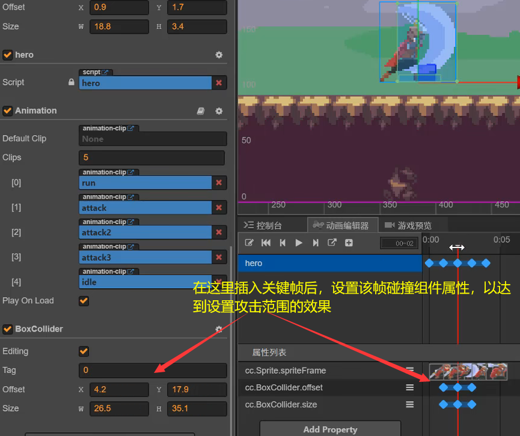

# 11.预制体(prefab) 与 对象池(NodePool)

## 11.1 预制体相当于一个模板，里面已经设置好了该节点所有的参数

```typescript
@property(cc.Prefab)
prefab:cc.Prefab=bull;
let bullet:cc.Node =cc.instantiate(this.prefab);


```

## 11.2 对象池(NodePool)

**使用场景**： 当游戏中频繁的创建/销毁节点时，就可以使用 **对象池技术**

性能问题解析：1. 一分钟内调用600次cc.instantiate()和node.destroy()【这个操作实际上都是非常消耗性能的，一般只在***初始化逻辑(onLoad)才会进行节点的创建，在切换场景时才会进行节点的销毁***】

​                           2.当node.destroy()时，该节点对象交给**GC(垃圾回收系统)**。但是GC并**不会立即执行**回收,而是等到合适的情况下再执行，这也就意味着当频繁的将节点交给GC时就会产生堆积的现象，使系统越来越慢。当创建对象过于频繁时，会影响GC效率。

### 11.2.1 对象池的使用

```typescript
//下方static的声明方式也可以是
static nodePool=null;
onload(){
    static nodePool=new cc.NodePool();
}


// 1.0 创建一个全局的对象池
static nodePool=new cc.NodePool();
// 2.0 初始化，向对象池添加 节点
for(let i=0;i<50;i++){
    node=cc.instantiate(prefab);
    nodePool.put(node)//向对象池放入预制体
}
// 3.0 需要使用节点时，从对象池中取出节点
node=nodePool.get()//从对象池中取出节点
if(node==null){node=cc.instantiate(prdfab)}
node.parent=....;node.position=...;
// 4.0 不需要使用该节点时，放回对象池
nodePool.put(node)
// 在使用 put 方法时 会在内部调用 node.removeParent()  功能为从父节点中删除该节点
```

# 12. 碰撞系统(Collision System)

用于检测物体(节点)之间的碰撞

## 12.1 添加碰撞体

**1.添加 碰撞体**

选中飞机节点，添加碰撞组件

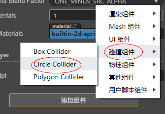

如图，有3种碰撞体可以选择：

- Box Collider 矩形碰撞体
- Circle Collider 圆形碰撞体
- Polygon Collider 多边形碰撞体 ( 即不规则形状 )

**2.编辑碰撞体**

勾选 Circle Collider 的 **Editing属性**，开启编辑

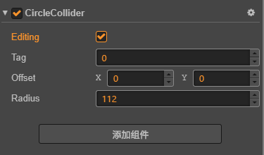

则在场景编辑器中，节点周围呈现一个 绿色 区域，可以拖动手柄调节此圆形区域大小。如下图所示。

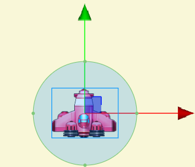

## 12.2 开启碰撞检测

```typescript
//碰撞组件 属于全局性的设置，一般放在全局设置中
onLoad(){
    //获取碰撞组件(碰撞管理器)
    let manager=cc.director.getCollisionManager();
    //开启碰撞检测
    manager.enabled=true
    //是否显示碰撞范围
    manager.enabledDebugDraw=true;
}
```

## 12.3 碰撞事件常用回调函数

```typescript
//碰撞发生   以下函数都没有代码提示
onCollisionEnter(other,self)(){。。。}

//碰撞进行中
onCollisionStay(other,self)(){。。。}

// 碰撞分开(两个碰撞体分开)
onCollisionExit(other,self)(){。。。}

//类似于 mouseenter, mousemove, mouseleave ，可以类比理解一下

/*other 和 self 表示的是碰撞组件对象 ，类型为 cc.Collider 。也就是说，实际上是检测到两个碰撞体之间的相遇，而不是节点的相遇。*/

//完整地写法如下：
    onCollisionEnter(other :cc.Collider, self :cc.Collider){
        let otherNode = other.node;  // 对方节点
        let selfNode = self.node; // 已方节点
		 ........ 更多处理
}
//other是一个组件，other.node就是该组件对应的节点对象。

```

**处理调用过程**：

1. 检测到Collider组件之间的碰撞
2. 找打各自的节点A,B
3. 找到A,B节点下的脚本组件,调用其onCollisionEnter()

## 12.4 设置碰撞组

1.如图所示 在项目设置打开碰撞组设置

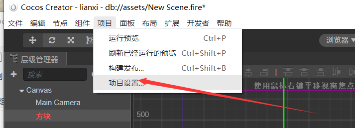

2.进行分组配对，点击**添加分组**来添加所需要的分组 并取名 

勾选的地方决定哪些组 会被碰撞管理器检测 为勾选的即使碰撞 检测器也不会 生效   


3. 在碰撞组件中设置Tag(标签)

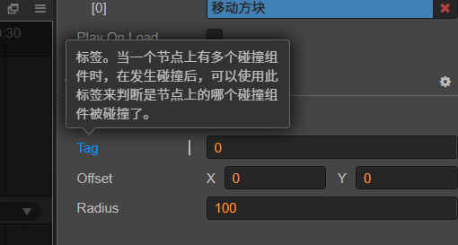

```typescript
//示例代码
onCollisionEnter(other:cc.Collider,self:cc.Collider){
    if(other.tag==100){//通过标记来判断碰撞对象
        cc.log('敌军')；
    }else if(other.group=='友军'){//通过分组来判断碰撞对象
        cc.log('友军')；
    }
}
```

# 13. 场景的切换(loadScene())

## 13.1 场景切换

```typescript
//从一个场景切换到另一个场景
cc.director.loadScene('新手村')
//注意:
//1.传入场景名即可，不需要路径与后缀名
//2. loadSene()不会瞬间完成，加载场景需要时间
```

## 13.2 场景与资源的关系

1. loadScene()需要加载 节点，节点上的组件，组件所引用的资源文件 spriteframe\audioclip等等
2. 每个资源文件都有一个 UUID(无论你为该文件取了什么名字，最后都会在系统内部生成一个UUID)，可右击资源文件来在菜单中选择显示该文件的UUID

3. 当一个资源未被引用，则它不会被加载
4. 多个节点都引用了同一个资源，所有的资源是一个资源对象，一个资源对象可以被多次使用，但不会被多次加载
5. 当从场景A切换到场景B，默认情况下场景A中的资源会被销毁

## 13.3 场景的 预加载(preloadScene)

预加载 preloadScene：将场景所引用的资源，预先加载到内存中

可以理解为 在第一个场景的onload()中，预先加载场景2,使在场景1时就已经将场景2的所有的资源加载完毕，使切换场景时 直接进入场景2.

### 13.3.1预加载API

```typescript
cc.director.preloadScene(sceneName(场景名),onProgress,onLoaded);
//onProgress:回调表示加载的进度
//onLoaded:回调表示已经加载完毕
```

示例代码：

```typescript
onLoad(){
    cc.director.preloadScene('新手村',
 function(count,total,item){
        cc.log('预加载场景'+count+'/'+total);
    },
 function(error:Error){
        if(error!=null){cc.log(error.message);}
        cc.log('加载完毕')
    }
)
}
//total:资源总数
//count:已加载完成的资源数量
```

**注意：**无论preloadScene()有没有完成，都可以直接调用loadScene()

 比如:preloadScene()需要10秒，3秒时调用loadScene()，则还需要7秒切换

## 13.4  场景加载进度

可以使用进度条组件 ProgressBar

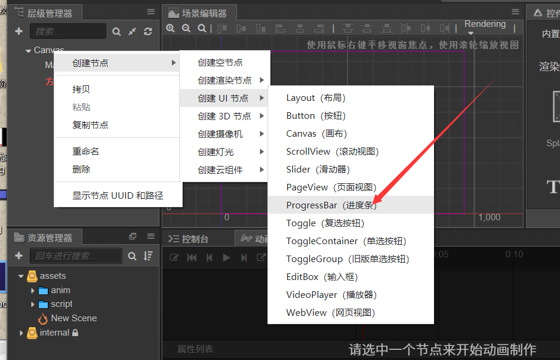

进度条相当于是父子节点 可以在属性检查器中修改进度条颜色等等

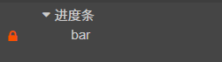

控制该进度条示例代码

```typescript
 progressNode : cc.Node = null;
 progressBar : cc.ProgressBar = null;
onLoad(){
    this.progressNode=cc.find('Canvas/进度条');
    this.progressBar=this.progressNode.getComponent(cc.ProgressBar);
    let that=this;
    cc.director.preloadScene('新手村',
 function(count,total,item){
        cc.log('预加载场景'+count+'/'+total);
        that.showProgress(count,total)
    },
 function(error:Error){
        if(error!=null){cc.log(error.message);}
        cc.log('加载完毕')
    }
)
}

showProgress(count,total){
    this.progressBar.progress=count/total;
}
```

# 14. 渲染类组件

渲染 :Render（渲染就是绘制的意思,可以绘制一个文本也可以绘制一个图片）

渲染类组件：RenderComponent

Label,Sprite,Graphics 均继承于**RenderComponent**

一个节点下，只能挂载一个渲染类组件，如添加了Label组件，就不能添加Sprite组件

## 14.1 Graphics绘制

如何绘制图形：

1. 定义路径：由直线、弧线、贝塞尔曲线连接而成

2. ```typescript
    let g:cc.Graphics=this.node.getComponent(cc.Graphics)
   //描边：
        g.strokeColor=...//设置颜色 
        g.lineWidth=..
        g.stroke();
   //填充
   g.fillColor=..//设置填充色
   g.fill();
   //更多见官方手册 
   ```

## 14.2 自定义渲染组件

```typescript
//在cocos 中添加的ts脚本 默认是继承cc.Component 则是一个普通的脚本组件
//如
@ccclass
export default class NewClass extends cc.Component {
}
//现在将cc.Component改为cc.Grapics 可使这个脚本组件变为渲染类组件
export default class NewClass extends cc.Grapics {
}
//此时可以在onLoad()或者start()中进行绘制
//并且此时可以直接在场景编辑器中预览
```

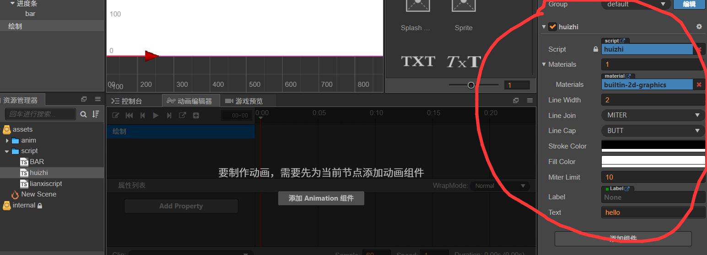

按上述修改父类后 普通脚本组件变为了上图所示状态

# 15.物理系统(Physics System)

即使用牛顿运动定律来**掌管场景内 物体 的运动**

此时的物体 ，称为物理学中的 **刚体(RigidBody)**

物理系统分为==RigidBody==【管理物理属性】与==Physicsboxcollider==【物理盒对撞属性管理】

<span style="color:red">物理系统的碰撞组件是基于刚体的组件，而碰撞组件是纯粹的基于碰撞区域的组件</span>.

## 15.1 物理系统组件的使用

1. 添加一个节点，并在属性检查器中添加物理组件 （这里假设添加RigidBody）
2. 在 游戏主控(全局设置-加载优先问题) 中使用如下代码打开物理系统

```typescript
onLoad(){
    cc.director.getPhysicsManager().enabled=true;
    cc.director.getPhysicsManager().debugDrawFlags=1;//开启碰撞区域绘制 默认为0 关闭。
    cc.director.gravity=cc.v2(0,0)//关闭重力
    //getPhysicsManager()返回与导演类 相关的物理管理器
    //getPhysicsManager().enabled是否开启物理系统
    
}
```

3. 可在物理组件中设置刚体的类型(type) 有四种类型 分别为

- static:0质量，0速度，不受重力影响。适合用于建筑物，地面等
- dynamic: 有质量，服从牛顿定律
- kinematice:0质量，可以有速度。如子弹这种小质量物体

## 15.2 刚体的碰撞

演示：(地面因为不希望受到重力影响所以 会设置为static类型)

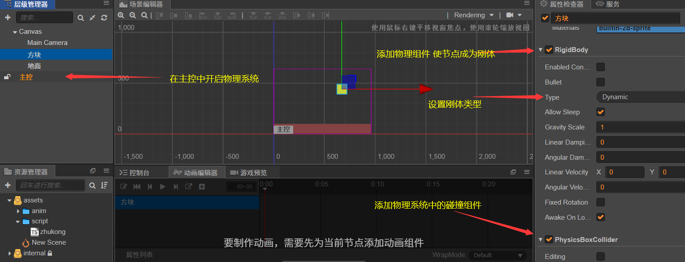

运行效果为 检测到碰撞以后 方块停止运动

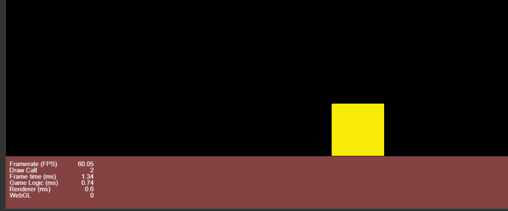

**补充：**Friction:摩擦系数，如斜坡下滑

​           Restitution:弹性系数，规定相撞时的反弹能力 如上设置系数为1时 会一直弹跳

```typescript
//如果是在游戏角色的控制当中，希望通过刚体来实现碰撞，需注意如果是直接设置修改角色的坐标来实现位移，会导致两个刚体直接出现穿过的状况(而不是发送碰撞停下来)
// 所以角色应通过刚体组件设置一个线性速度,如:
sp: cc.Vec2 = cc.v2(0, 0);//表示hero的移动状态
this.lv=this.node.getComponent(cc.RigidBody).linearVelocity;//获取当前的线性速度

this.lv.x=this.sp.x*this.speed;
this.lv.y=this.sp.y*this.speed;

this.node.getComponent(cc.RigidBody).linearVelocity=this.lv//重新赋值回去
```


## 15.3刚体的碰撞回调

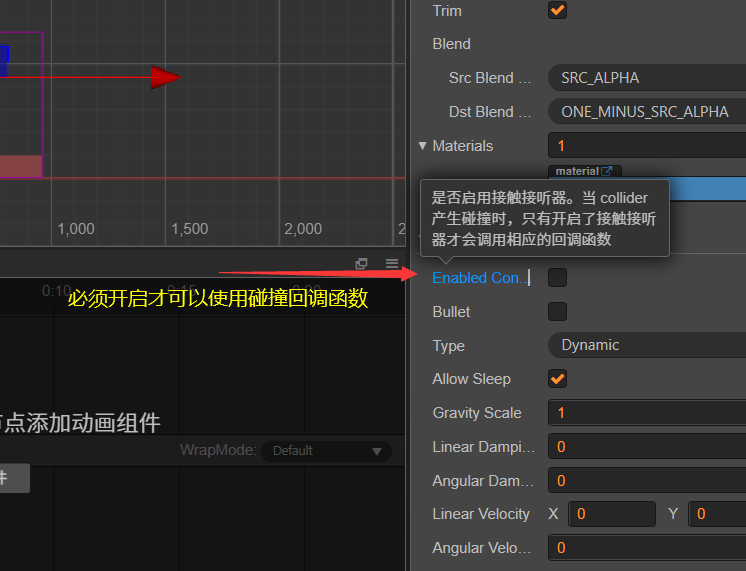

首先需要勾选节点的RigidBody组件中的Enable Contact Listener

其次附加脚本

```typescript
// 只在两个碰撞体开始接触时被调用一次
    onBeginContact (contact:cc.PhysicsContact, selfCollider:cc.PhysicsCollider, otherCollider:cc.PhysicsCollider) {
       
    }

    // 只在两个碰撞体结束接触时被调用一次
    onEndContact (contact:cc.PhysicsContact, selfCollider:cc.PhysicsCollider, otherCollider:cc.PhysicsCollider) {
        
    }
    
    // 每次将要处理碰撞体接触逻辑时被调用
    onPreSolve (contact, selfCollider, otherCollider) {
    }

    // 每次处理完碰撞体接触逻辑时被调用
    onPostSolve (contact, selfCollider, otherCollider) {
    }
//参数
/*selfCollider：指的是回调脚本的节点上的碰撞体；
otherCollider：指的是发生碰撞的另一个碰撞体；
contact：本次接触事件；  是一个 IPhysics2DContact。包含碰撞最主要的信息。其中比较常用的信息就是碰撞的位置和法向量，contact 内部是按照刚体的本地坐标来存储信息的，而我们一般需要的是世界坐标系下的信息，我们可以通过 contact.getWorldManifold 来获取这些信息。注意，在 Builtin 物理模块这个参数为空。*/
```

**补充**:同样支持碰撞组

## 15.4 力与冲量

移动一个物体有**两种方式**：F=ma   P=mv

1. 可以施加一个力或者冲量到这个物体上。力会随着时间慢慢修改物体的速度，而冲量会立即修改物体的速度。
2. 直接修改物体的位置，只是这看起来不像真实的物理，你应该尽量去使用力或者冲量来移动刚体，这会减少可能带来的奇怪问题。

```typescript
force:物体受到的力   impulse:物体的冲量  point:受力点(要求是世界坐标，所以需要转换)
// 施加一个力到刚体上指定的点，这个点是世界坐标系下的一个点
rigidbody.applyForce(force, point);

// 或者直接施加力到刚体的质心上
rigidbody.applyForceToCenter(force);

// 施加一个冲量到刚体上指定的点，这个点是世界坐标系下的一个点
rigidbody.applyLinearImpulse(impulse, point);
```

在以上方块落至地面后，希望点击方块 给它向上的冲量或持续力使其弹起 可使用如下代码

```typescript
 onLoad () {
         this.node.on('touchstart',this.onClick,this)
         this.node.on('touchmove',this.onmove,this)
     }
     onClick(){//物体获得冲量改变运动状态
        let rigidbody:cc.RigidBody=this.node.getComponent(cc.RigidBody);     
        let force:cc.Vec2=cc.v2(0,1000);//冲量是一个矢量，即有大小也有方向
        let pt:cc.Vec2=cc.v2(0,0);
        pt=this.node.convertToWorldSpaceAR(pt);
        rigidbody.applyLinearImpulse(force,pt,true);//冲量则是一瞬间完成，
     }

     onmove(){//物体受到持续的力改变运动状态
       let  rigidbody:cc.RigidBody=this.node.getComponent(cc.RigidBody);
       let pt:cc.Vec2=cc.v2(0,0);
       pt=this.node.convertToWorldSpaceAR(pt);
       rigidbody.applyForce(new cc.Vec2(0,1000),pt,true)//力需要持续施加 来逐渐改变物体的运动状态             
  }
```

# 16. 摄像机的使用

## 16.1 摄像机跟随

首先：建立一个需要被跟随的节点与摄像机的关联

```typescript
@property(cc.Node)
  player:cc.Node=null;
```

第二步：将脚本挂载到Main Camera 下，并及时关联跟随对象

第三步：代码控制

```typescript
//updata中进行判断
updata(dt){
    if(!this.player){return;}//没有挂载摄像机时直接return
    //首先拿到当前玩家 所在 的节点，再将其转换为 世界坐标 的节点
    let w_pos:cc.Vec2=this.player.convertToWorldSpaceAR(cc.v2(0,0))
    //cc.v2(0,0)表示的玩家对当前位置的偏移量[或者理解为玩家现在所处的坐标系下的坐标就是(0,0)]
    let n_pos:cc.Vec2=this.node.parent.convertToNodeSpaceAR(w_pos);
    this.node.position=cc.v3(n_pos.x,n_pos.y,0);
   
}
```

第四步：修改摄像机的background属性，它的功能是当摄像机观测到，你没有绘制的地方时，它会默认将他们全部修改成黑色，所以很有可能与地图风格不匹配，所以需要注意修改

# 制作技巧

## 1.组件BlockInputEvents(ccs3.0中在events中)

用来配合遮罩 阻止所有的鼠标，触摸输入事件

## 2.屏幕适配

(1)cocos中的坐标单位是像素，但是它是游戏分辨率的像素，不等同于屏幕分辨率的像素

(2)**分辨率**(Resolution):指画面中有多少个点, 每个点都称为一个**像素**(Pixel) ，但是一个**像素到底有多大则是一个相对值,**如5寸的屏幕与20寸的屏幕分辨率都可以设置为1920*1080

(3)**坐标的计算**:坐标的计算单位 并不是根据适配屏幕之后的分辨率，而是根**据设计游戏时的分辨率来计算**

1.在实际运用中 根据使用者的屏幕分辨率的不同 画布实际分辨率 也会不同

如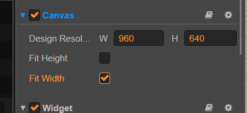

这里画布的设计分辨率为960*640 然而因为

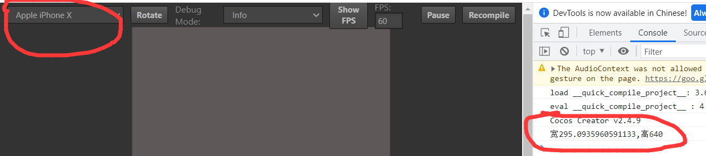

iphone X 的分辨率不是960*640 则进行了相应的缩放导致画布的 宽或高 随之发生了相应的变化

**但是**:(1) 可以根据上图中的 fit Height(根据设备高度自动拉伸高度)  和 fit Width(根据设备高度自动拉伸宽度) 来适配屏幕分辨率 使得画布可以完整显示

​        (2)当原本设置得节点位置 因为屏幕适配问题 而不在原本计划得位置时 可以使用Widget组件来**固定节点距离父节点 各方向底部的距离 使其一直保持在预想的位置**

## 3. Tiled与像素素材

### 3.1 像素素材设置

当使用像素素材时 需要将filter mode 从bilinear(双线性)修改为point(最邻近插值法)

不然会出现图像模糊的状况

### 3.2 Tiled墙体技巧

在设置是瓦片的刚体碰撞时，要为角色额外设置一些摩擦系数来防止被瓦片卡住

## 4. 战争迷雾的制作

首先结合tiled，为地图添加一个smog层遮蔽住其他所有层级

有两种方式：

1. 添加一个坐标判断。通过updata来实时刷新附近可以看到的区域，并将对应区域置空
2. 添加一个碰撞体，碰撞后置空

演示第二种方式：

step1：为角色【也可以在角色下面挂载一个专用于碰撞的节点】添加碰撞组件(最好是圆形的)，并调整半径来确定视野范围

step2：添加碰撞分组smog，勾选角色与smog的碰撞，在脚本中开启碰撞

step3:类似如下操作

```typescript
protected start(): void {
    for (let mapNode of this.mapNode.children) {
      let tiledMap = mapNode.getComponent(cc.TiledMap)
      let tiledSize: cc.Size = tiledMap.getTileSize()  // 获取每一小块的尺寸
      let layer: cc.TiledLayer = tiledMap.getLayer('wall')//通过getlayer获取对应层级
      let layerSize: cc.Size = layer.getLayerSize();// 注意tiled层级的尺寸的单位是块，并不是实际上的像素，所以这里获取的尺寸是值块的个数
      let smogLayer:cc.TiledLayer=tiledMap.getLayer('smog')//获取迷雾层
      smogLayer.node.active=true// 如果原本隐藏了smog层，这里就需要显示迷雾

      for (let i = 0; i < layerSize.width; i++) {
        for (let j = 0; j < layerSize.height; j++) {
          tiled=Layer.getTiledTileAt(i,j,true)//通过坐标来获取迷雾对应的块
          if (tiled.gid != 0) {  // 每一个块都有一个对应的id,当它不等于0时，说明这一块的元素是存在的        
            tiled.node.group = 'smog' //  将被附加该组件的节点的分组修改
            let colloder:cc.BoxCollider=tiled.node.addComponent(cc.BoxCollider)// 添加方形碰撞组件
            colloder.offset = cc.v2(tiledSize.width / 2, tiledSize.height / 2);//修改每一块的偏移量
            colloder.size = tiledSize;
          }

        }
      }
    }
```

step4：在挂载碰撞区域的节点的脚本中的updata添加碰撞回调来完成擦除

```typescript
  onCollisionEnter(other,self){
        if(other.node.group='smog'){
            other.node.active=false;
            other.node.getComponent(cc.TiledTile).gid=0;//每一个块都有一个对应的id,当它等于0时，说明这一块的元素是不存在的
        }
    }
```

## 5. 加载页面

可以制作一个覆盖的整个界面的遮罩层，并且在加载资源之前设置一个变量用来计算已经执行加载多少次了，并在每次加载完成后的地方同时在添加一个判断 先自减以后是否为0 ，为0则关闭遮罩层，(考虑到了异步)
