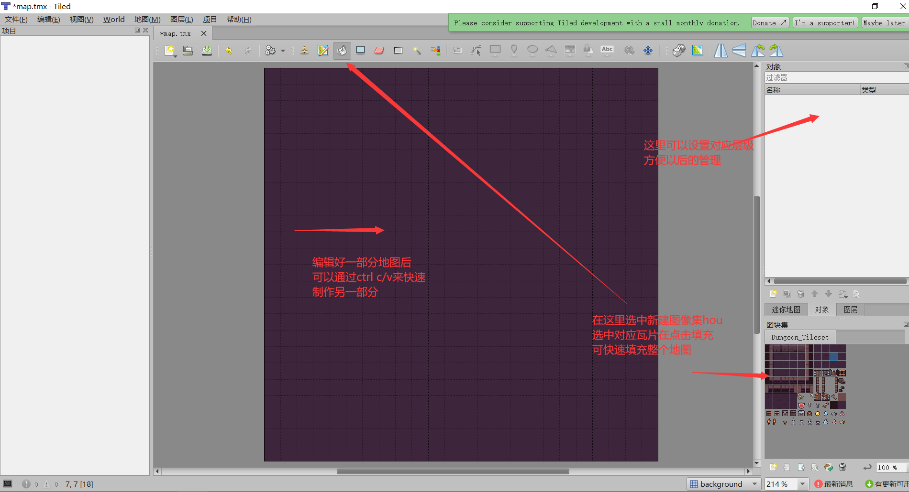
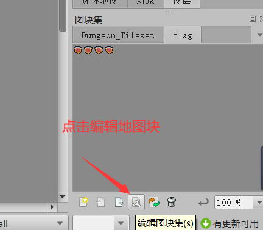
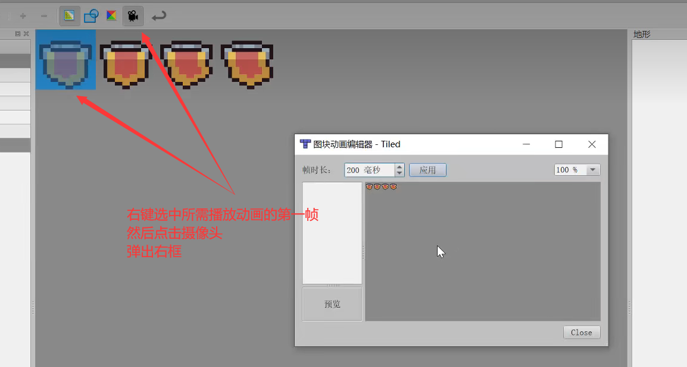
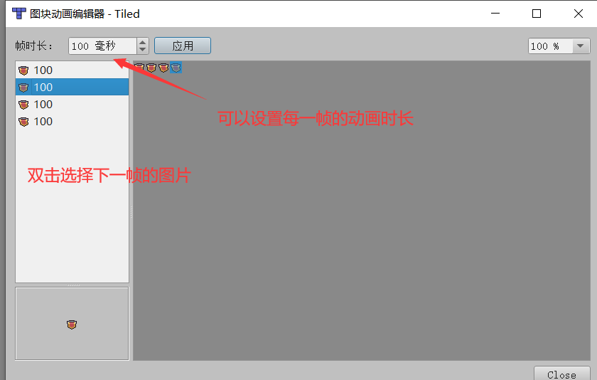

# 一、基础地图制作

创建地图需注意匹配素材的大小，不然会出现重叠等问题

## 1. 地图的基本制作



## 2. 动态地图

第一步：



第二步：



第三步：随后可以新键一个图层用来存放这些小的设计



# 二、Tiled层级的获取

在使用地图时，一定注意锚点的位置，不然会出现错位，一般都设置为左下角(0,0)

## 2.1 读取单张地图

```typescript
 @property(cc.TiledMap)
  tiledMap: cc.TiledMap = null; //关联地图节点

onload(){
    let tiledSize:cc.Size=this.tiledMap.getTileSize()  // 获取每一小块的尺寸
    let layer: cc.TiledLayer = this.tiledMap.getLayer('wall')//通过getlayer获取对应层级
    let layerSize: cc.Size = layer.getLayerSize();// 注意tiled层级的尺寸的单位是块，并不是实际上的像素，所以这里获取的尺寸是值块的个数
    for (let i = 0; i < layerSize.width; i++) {
      for (let j = 0; j < layerSize.height; j++) {
        let tiled: cc.TiledTile = layer.getTiledTileAt(i, j, true);//通过坐标来获取对应的块
        if (tiled.gid != 0) {  // 每一个块都有一个对应的id,当它不等于0时，说明这一块的元素是存在的
          tiled.node.group = 'wall' //  将被附加该组件的节点的分组修改
          let body: cc.RigidBody = tiled.node.addComponent(cc.RigidBody);
          body.type = cc.RigidBodyType.Static //修改刚体类型
          let colloder: cc.PhysicsBoxCollider = tiled.node.addComponent(cc.PhysicsBoxCollider)
          colloder.offset=cc.v2(tiledSize.width/2,tiledSize.height/2);//修改每一块的偏移量
          colloder.size=tiledSize;//包围盒(碰撞范围)的大小设置为块的尺寸
          colloder.apply();//应用对物理组件的修改[因为是刚体才需要加apply，单纯的碰撞组件不需要加]
        }
      }
    }
}
```

## 2.2 读取多张地图

方式：将多张地图全部挂载到一个节点之下，作为它的子节点，随后通过代码逐个读取

```typescript
 @property(cc.Node)
  mapNode: cc.Node = null;

  protected start(): void {
    for (let mapNode of this.mapNode.children) {
      let tiledMap = mapNode.getComponent(cc.TiledMap)
      let tiledSize: cc.Size = tiledMap.getTileSize()  // 获取每一小块的尺寸
      let layer: cc.TiledLayer = tiledMap.getLayer('wall')//通过getlayer获取对应层级
      let layerSize: cc.Size = layer.getLayerSize();// 注意tiled层级的尺寸的单位是块，并不是实际上的像素，所以这里获取的尺寸是值块的个数
      for (let i = 0; i < layerSize.width; i++) {
        for (let j = 0; j < layerSize.height; j++) {
          let tiled: cc.TiledTile = layer.getTiledTileAt(i, j, true);//通过坐标来获取对应的块
          if (tiled.gid != 0) {  // 每一个块都有一个对应的id,当它不等于0时，说明这一块的元素是存在的
            tiled.node.group = 'wall' //  将被附加该组件的节点的分组修改
            let body: cc.RigidBody = tiled.node.addComponent(cc.RigidBody);
            body.type = cc.RigidBodyType.Static //修改刚体类型
            let colloder: cc.PhysicsBoxCollider = tiled.node.addComponent(cc.PhysicsBoxCollider)
            colloder.offset = cc.v2(tiledSize.width / 2, tiledSize.height / 2);//修改每一块的偏移量
            colloder.size = tiledSize;//包围盒(碰撞范围)的大小设置为块的尺寸
            colloder.apply();//应用对物理组件的修改
          }
        }
      }
    }

```


# 三、 地图文件的取名

可以用一些数字来为地图文件取名 方便调用时获取对应的地图

例如：00010

​           00100

​           01000

​          10000

​          11110

​          11111

这些数字有着特殊的含义，每一个数字依次对应s'x
